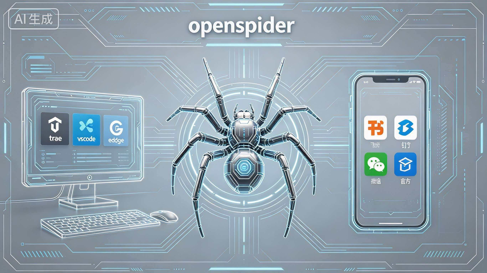

# openspider

> 🕷️ Your PC, Controlled from Your Phone — Without Spending a Single Token

---

## 😩 Tired of Burning Money on AI Tokens?

Every month, you watch your AI bills climb higher. You're paying for every message, every task, every little interaction. But what if you could tap into **free web AI** — like Trae app, Doubao, or Deepseek web — at zero cost?

**openspider** is your gateway to effortless PC control. Imagine sitting on the couch, sending a quick message from WeChat, and watching your computer write code, search the web, or organize your files — all without touching the keyboard. All without feeding another cent to cloud AI providers.

---

## ✨ What Can openspider Do?

### 🤖 Chat Mode — Your Desktop AI, in Your Pocket

Forward messages from WeChat, Feishu, or DingTalk directly to desktop AI powerhouses like **Trae, VS Code, or Edge**. openspider acts as your intelligent proxy — sending requests, handling UI interactions, and relaying responses right back to your phone.

**You get the full power of desktop AI, from any chat app, anywhere.**

### ⚡ Command Mode — Instant Local Actions

No AI needed for simple tasks. Take screenshots, send files, launch apps, or run your custom scripts — all triggered by simple commands from your phone.

**Your PC responds instantly. No cloud. No delay. No cost.**

---

## 🎯 Why openspider?

| Feature | Why It Matters |
|---------|---------------|
| 💰 **Zero Token Cost** | Leverage free web AI like Trae app, Doubao, Deepseek web — no token fees, ever |
| 🤖 **PC Autopilot** | Like OpenClaw, but free — let AI control your desktop to get things done |
| 👁️ **Real-Time Vision** | Screenshot commands let you monitor progress visually, anytime |
| � **Any Chat App** | WeChat, Feishu, DingTalk — your familiar apps, now superpower |
| 🔌 **Fully Extensible** | Add new apps, tools, and commands with ease |
| 🛡️ **Privacy First** | Your data never leaves your devices |
| 🧩 **100% Open Source** | Customize every line to fit your workflow |

---

## 🚀 Quick Start

### 1. Clone the Project
```bash
git clone https://github.com/secondsuqin/openspider
```

### 2. Configure Feishu Bot
1. Register account at `https://open.feishu.cn/`
2. Go to **Developer Console** → **Create Enterprise Self-built App**
3. Add app capability → Select **Bot**
4. Create a version and publish
5. Find **App ID** and **App Secret** in **Credentials & Basic Info**
6. Modify the `.env` file:
```
FEISHU_APP_ID = "your App ID"
FEISHU_APP_SECRET = "your App Secret"
```

### 3. Install TRAE
Download from: `https://www.trae.cn/ide/download`

**Important:** Remember to check "Add to PATH" during installation.

### 4. Configure TRAE
1. Open TRAE and log in to your account
2. Switch to **Solo Mode**

### 5. Open the Project
Navigate to the cloned project directory, right-click, and select **"Open with TRAE"**

### 6. Run the Bot
Tell TRAE (or type in terminal):
> "Please run `combined_bot` and install dependencies from `requirements.txt` until it works."

**Note:** When running successfully, you may see the message "WARNING - 没有可用的 chat_id，无法发送飞书消息". This is normal at this stage.

### 7. Configure Feishu Bot Events
When you see the warning above, go back to **Feishu Developer Console** and do the following:

1. Navigate to **Events & Callbacks** → **Event Configuration**
2. Under **Subscription Method**, select **"Use Long Connection to Receive Events"**
3. Click **Verify** and save


4. Add the following events:
   - ✅ 接收消息 (im.message.receive_v1)
   - ✅ 消息被reaction (im.message.reaction)
   - ✅ 消息被取消reaction (im.message.reaction)

5. In **Permission Management**, click **Batch Import** and paste the contents from `飞书权限.txt` in the project root.


6. When Feishu prompts "版本发布后，当前修改方可生效" (Changes take effect after version release), click the **"创建版本" (Create Version)** button on that prompt, then save and confirm the release.

---

## 🚀 快速开始（中文版）

### 1. 克隆项目
```bash
git clone https://github.com/secondsuqin/openspider
```

### 2. 配置飞书机器人
1. 在 `https://open.feishu.cn/` 注册账号
2. 进入**开发者后台** → **创建企业自建应用**
3. 添加应用能力 → 选择**机器人**
4. 创建版本并确认发布
5. 在**凭证与基础信息**中找到 **App ID** 和 **App Secret**
6. 修改本地文件 `.env`，内容：
```
FEISHU_APP_ID = "你的App ID"
FEISHU_APP_SECRET = "你的App Secret"
```

### 3. 安装 TRAE
下载地址：`https://www.trae.cn/ide/download`

**重要：** 安装时请勾选"添加到 PATH"。

### 4. 配置 TRAE
1. 打开 TRAE 并登录账号
2. 切换到 **Solo 模式**

### 5. 打开项目
进入克隆的项目目录，右键选择**"使用 TRAE 打开"**

### 6. 运行机器人
告诉 TRAE（或在终端输入）：
> "Please run `combined_bot` and install dependencies from `requirements.txt` until it works."

**注意：** 运行成功后可能会看到提示"WARNING - 没有可用的 chat_id，无法发送飞书消息"。这是正常现象。

### 7. 配置飞书机器人事件
看到上述警告后，回到**飞书开发者后台**，进行以下操作：

1. 进入**事件与回调** → **事件配置**
2. 在**订阅方式**中选择**"使用长连接接收事件"**
3. 点击**验证**并保存

4. 添加以下事件：
   - ✅ 接收消息 (im.message.receive_v1)
   - ✅ 消息被reaction (im.message.reaction)
   - ✅ 消息被取消reaction (im.message.reaction)

5. 在**权限管理**中，点击**批量导入**，将项目根目录的 `飞书权限.txt` 文件内容粘贴进去

6. 当飞书提示"版本发布后，当前修改方可生效"时，点击提示中的**"创建版本"**按钮，然后保存并确认发布

---

## 🧱 How It Works

### Chat Mode Flow

```
Mobile Chat → openspider → Desktop AI Agent (Trae/VS Code/Edge) → openspider → Mobile Chat
```

The spider relays messages, handles UI/API interactions, and extracts responses for you.

### Command Mode Flow

```
Mobile Chat → openspider → Predefined Command Handler → Local PC Action
```

No AI needed — execute pre-built or custom commands directly on your machine.

---

## 🚀 Coming Soon

- 📦 Support for Telegram, Discord, Slack, and more
- 🖥️ VS Code, browser, and IDE integrations
- 📝 Simple command definition framework for custom tasks
- 🌐 Cross-platform support (Windows, macOS, Linux)
- ⚡ Lightweight, low-resource background service

---

## 📄 License

Open-source under the MIT License. Contributions, issues, and feature requests are welcome!

**Ready to stop burning cash on tokens? Let's spin up openspider.** 🕷️
